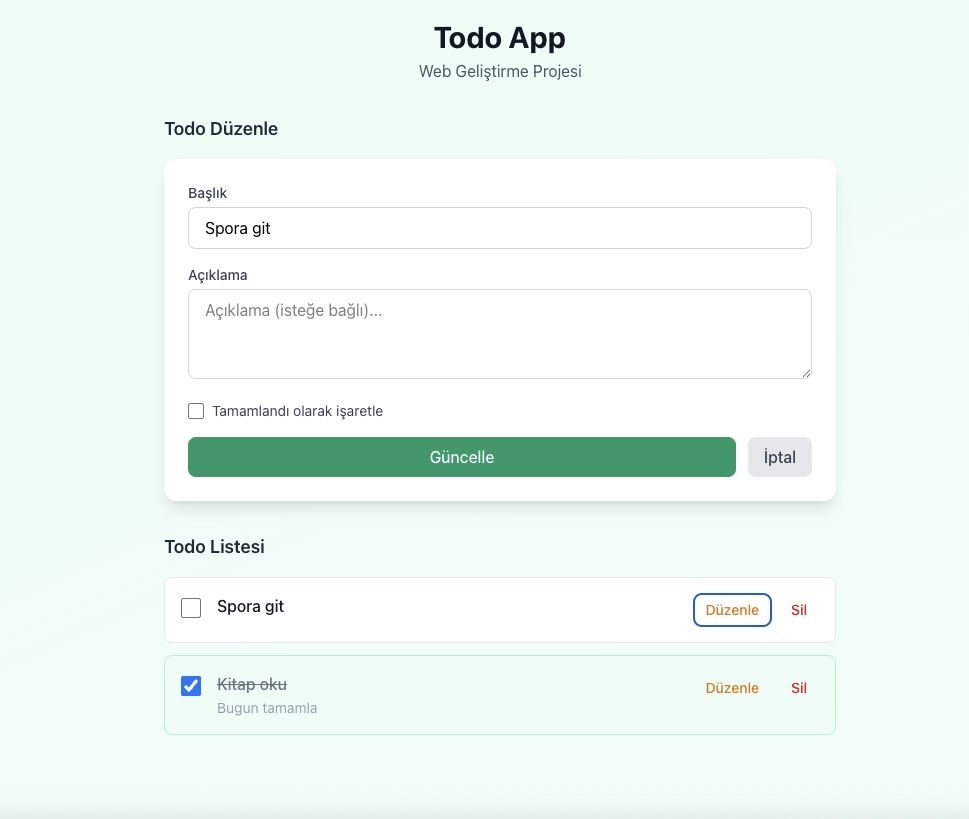

# Todo App - Web Geliştirme Projesi

ReactJS ve Vite kullanarak geliştirilmiş, LocalStorage ile veri saklayan tam CRUD (Ekleme, Listeleme, Güncelleme, Silme) Todo uygulaması.

## Özellikler

- ✅ **Ekle** - Yeni todo ekleme
- ✅ **Listele** - Tüm todoları listeleme
- ✅ **Güncelle** - Mevcut todo düzenleme
- ✅ **Sil** - Todo silme
- ✅ LocalStorage ile veri kalıcılığı
- ✅ Tailwind CSS ile modern tasarım
- ✅ Netlify'a deploy edilebilir
- ✅ TypeScript desteği

## Proje Yapısı

```
src/
├── Components/        # Yeniden kullanılabilir bileşenler
│   ├── TodoForm.tsx   # Ekleme/Düzenleme formu
│   ├── TodoItem.tsx   # Tekil todo kartı
│   └── TodoList.tsx   # Todo listesi
├── Interfaces/        # TypeScript tipleri
│   └── Todo.ts
├── Pages/             # Sayfa bileşenleri
│   └── TodoPage.tsx   # Ana sayfa
├── utils/             # Yardımcı fonksiyonlar
│   └── storage.ts     # LocalStorage işlemleri
├── App.tsx
├── main.tsx
└── index.css
```

## Kurulum ve Çalıştırma

### Ön Gereksinimler

- Node.js (v18 veya üzeri)
- npm veya yarn

### Adımlar

1. Bağımlılıkları yükleyin:

```bash
npm install
```

2. Geliştirme sunucusunu başlatın:

```bash
npm run dev
```

Uygulama [http://localhost:5173](http://localhost:5173) adresinde çalışacaktır.

3. Production build almak için:

```bash
npm run build
```
## Teknolojiler

- **React 18** - UI kütüphanesi
- **Vite** - Build aracı
- **Tailwind CSS** - Stil framework
- **TypeScript** - Tip güvenliği

## Ekran Görüntüsü


